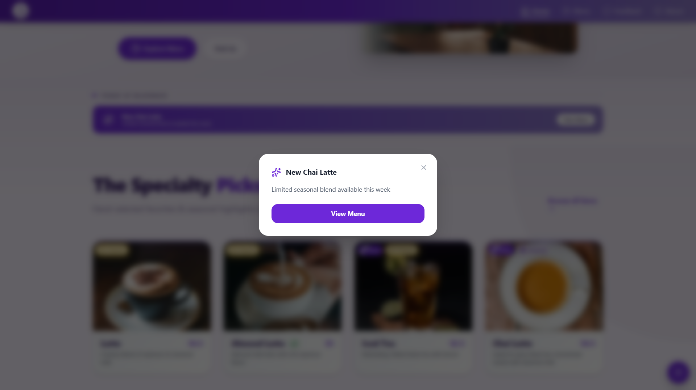
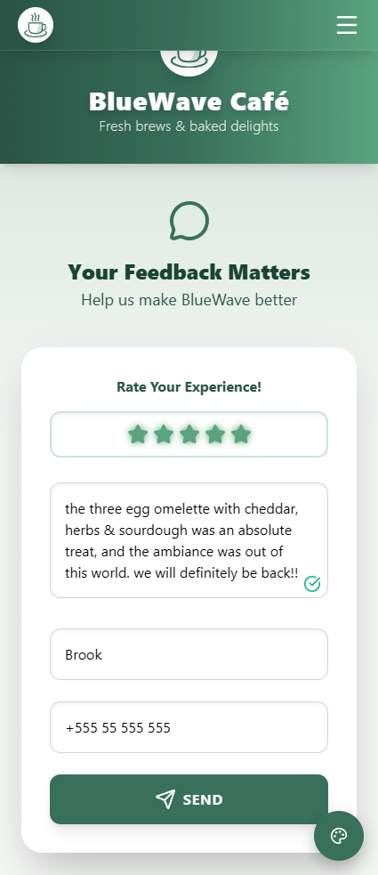

# ☕ BlueWave Café v2.0 - Interactive Web Application

**BlueWave Café** is a modern, high-performance, and fully themeable web application built with **React**, **Vite**, and **Tailwind CSS**, featuring a serverless feedback system powered by Cloudflare Workers and Resend API.

Version 2.0 introduces a complete **Cafe Landing Page redesign**, improved UI architecture, and enhanced scalability, transforming the project from a simple menu interface into a more **production-ready, scalable frontend application**.

It recreates a real café's digital experience, showcasing expertise in responsive UI/UX, component architecture, performance optimization, and accessible frontend design.

This project serves as both a **technical showcase** and a **portfolio piece** highlighting strong React development practices and real-world frontend architecture.

## 🚀 Live Demo

Explore the full experience, including dynamic themes and smooth animations:

🔗 **[https://bluewave-cafe.pages.dev](https://bluewave-cafe.pages.dev)**

## 🧠 Highlights

- Built as a **real-world scalable frontend**, not just a static UI
- Fully **themeable design system** using Tailwind CSS variables
- **Component-driven architecture** with reusable UI primitives
- **Serverless backend integration** using Cloudflare Workers
- Focus on **performance, accessibility, and UX polish**
- Feature-based folder structure with separation of concerns

## 📸 Preview







## ✨ Key Features

| Feature                            | Technologies Used                                                                             | Benefit                                                                                                                                                                                       |
| :--------------------------------- | :-------------------------------------------------------------------------------------------- | :-------------------------------------------------------------------------------------------------------------------------------------------------------------------------------------------- |
| **Dynamic Theming**                | React Context API, Tailwind CSS variables                                                     | Enables instant theme switching using global state with real-time favicon color injection.                                                                                                    |
| **Performance-First Architecture** | **`React.lazy()`**, `Suspense`, Vite `manualChunks`, image `fetchPriority`                    | Route-based code splitting and optimized build setup enable lightning-fast initial loads.                                                                                                     |
| **Dynamic Menu Routing**           | **React Router v7**, Route Params                                                             | Enables direct linking to menu categories (e.g. `/menu/coffee`) for better UX and navigation.                                                                                                 |
| **Serverless Email System**        | **Cloudflare Worker**, [Resend API](https://resend.com/)                                      | Securely handles feedback form submissions without exposing backend credentials. The Worker validates input, calls Resend's REST API, and sends confirmation emails with high deliverability. |
| **Elegant UI/UX Design**           | **`framer-motion`**, Tailwind CSS, dynamic favicon, responsive layout                         | Provides a polished, responsive, and accessible interface with subtle motion effects, smooth transitions, and real-time theme reflection in the favicon.                                      |
| **Cafe Landing Page**              | Modular React components, responsive layout, Google Maps Embed API (iframe-based integration) | Provides a complete real-world landing experience with hero, testimonials, announcements, and location integration.                                                                           |
| **Reusable UI System**             | Reusable UI primitives (Button, Badge, Modal, etc.)                                           | Promotes consistency, scalability, and faster development across the app.                                                                                                                     |
| **Custom Hooks System**            | `useScrollTo`, `useAutoRotate`, `useNavigationHandler`                                        | Encapsulates logic cleanly and improves code reusability and separation of concerns.                                                                                                          |
| **Scalable Data Management**       | Centralized **`/config`** and **`/data`** directories                                         | All site data (e.g. navigation, metadata, hours, menu items) is externally managed, simplifying updates and long-term scalability.                                                            |
| **SEO & Routing Optimization**     | **React Router v7**, `PageTitleHandler.jsx`, `site.js`, `navigation.js`                       | Automatically generates descriptive page titles and meta tags for better SEO and user experience.                                                                                             |

## 🛠️ Tech Stack

- **Framework:** [React](https://reactjs.org/) (Hooks, Context, Lazy Loading)
- **Build Tool:** [Vite](https://vitejs.dev/)
- **Styling:** [Tailwind CSS](https://tailwindcss.com/)
- **Animations:** [Framer Motion](https://www.framer.com/motion/)
- **Routing:** [React Router DOM 7](https://reactrouter.com/)
- **Icons:** [Lucide React](https://lucide.dev/icons/) & [Iconify](https://iconify.design/docs/icon-components/react/) for social media icons
- **Backend:** [Cloudflare Workers](https://developers.cloudflare.com/workers/) + [Resend API](https://resend.com/) for serverless email handling

## ⚡ Performance

Tested using **Google PageSpeed Insights** (Mobile, slow 4G throttling):

- **Performance:** 96-99 / 100 (depending on route)
- **Accessibility:** 100 / 100
- **Best Practices:** 100 / 100
- **SEO:** 100 / 100

**Desktop:** 100 / 100 across all categories.

> Benchmarked on the landing page (most resource-intensive route).

📊 [Full Lighthouse Report (Landing Page)](https://pagespeed.web.dev/analysis/https-bluewave-cafe-pages-dev/kdabkbs5r4?form_factor=mobile)

## ☁️ Backend

The project leverages a **Cloudflare Worker** to manage form submissions securely.  
When the user submits feedback, the Worker validates input, communicates with the **Resend API**, and sends emails without exposing sensitive credentials.

This simulates a **real-world serverless backend architecture** without requiring a traditional server.

_(Currently configured to send feedback to a test inbox for demonstration purposes.)_

## 📡 Deployment

BlueWave Café is deployed on **Cloudflare Pages**, with its **Cloudflare Worker** integrated under the same project namespace.

This setup ensures:

- Zero server maintenance
- Edge-based scalability and speed
- Automatic CI/CD via `git push`

## 💻 Local Setup

To run **BlueWave Café** locally, follow these steps:

### 1. Prerequisites

Install **Node.js** (LTS version) and **npm** or **yarn**.

### 2. Clone the Repository

```bash
git clone https://github.com/chko0/bluewave-cafe.git
cd bluewave-cafe
```

### 3. Install Dependencies

Using npm:

```bash
npm install
```

or yarn:

```bash
yarn install
```

### 4. Start the Development Server

```bash
npm run dev
```

or:

```bash
yarn dev
```

The application will now be running on http://localhost:5173 (or another port if 5173 is occupied).

### 5. Build for Production

To create a production-ready optimized build:

```bash
npm run build
```

or:

```bash
yarn build
```

The production build will be located in the `/dist` folder.

## 📂 Project Structure

The codebase follows a predictable, feature-based structure to ensure high maintainability:

```bash
/
├── public/             # Static assets (Optimized .webp menu items & hero images)
│   └── robots.txt      # SEO configuration file
│
└── src/
    ├── assets/         # Source assets (Favicon for dynamic SVG manipulation)
    ├── components/        # Reusable UI Components
    │   ├── common/        # Global cross-cutting components (Logo, Title Handlers)
    │   ├── home/          # Feature-specific components for the Landing Page
    │   ├── layout/        # Structural wrappers (Navbar, Footer, MainLayout)
    │   ├── menu/          # Menu domain logic and display components
    │   └── ui/            # Atomic UI primitives (Button, Badge, Modal, etc.)
    ├── config/         # Centralized constants (e.g. Hours, Navigation, Socials, API Endpoints, Contact Info)
    ├── context/        # Global state management (ThemeContext.jsx)
    ├── data/           # Decoupled data content (Menu Items, Testimonials, Announcements)
    ├── hooks/          # Custom React Hooks (Navigation Handlers, Feedback Logic, ...)
    ├── pages/          # Route-specific components (MenuPage, AboutPage, NotFoundPage, ...)
    ├── styles/         # Global CSS and specialized component animations
    ├── themes/         # Theme definitions
    ├── utils/          # Helper functions and utility logic
    ├── App.jsx         # Routing & Provider orchestration
    └── main.jsx        # App entry point
```

## 🔖 Versioning

- **v2.0** — Cafe Landing Page, improved architecture, and UI system
- **v1.0** — Initial release (menu-focused experience)

Version history is available via Git tags and pull requests.

## 🚧 Future Improvements

- Add a CMS or admin dashboard for dynamic menu editing
- Multi-language support (Arabic & English)
- Payment and order integration
- PWA support for offline browsing

---

**Crafted with ❤️ and caffeine.**
