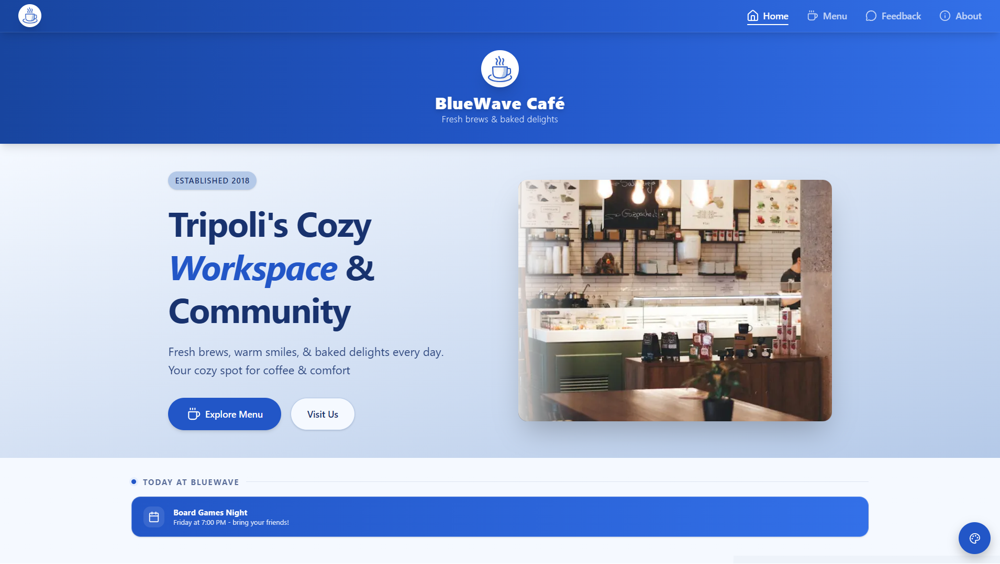
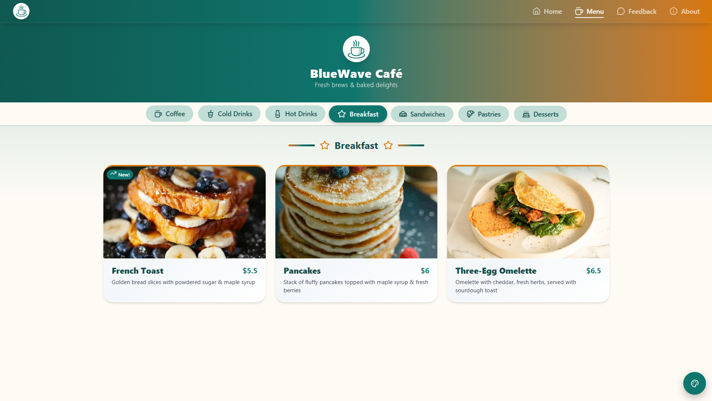
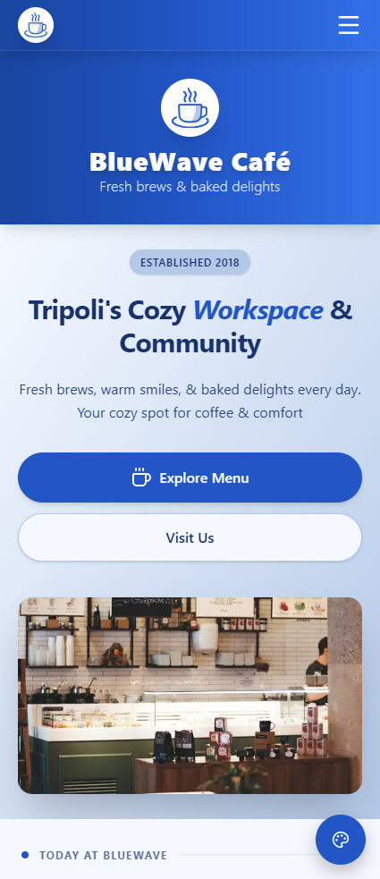
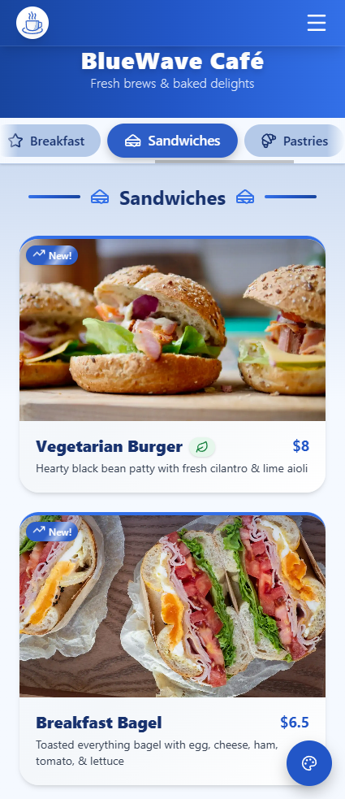

# ☕ BlueWave Café v2.0 - Interactive Web Application

**BlueWave Café** is a production-style frontend application that recreates a real café's digital experience - featuring dynamic theming, route-based menu navigation, and a serverless feedback system.

Built with **React, Vite, and Tailwind CSS**, the project focuses on scalable architecture, performance optimization, and polished user experience.

## 🔗 Live Demo

https://bluewave-cafe.pages.dev

## 🧠 Highlights

- Built as a **scalable frontend architecture**, not just a static UI
- Fully **themeable design system** (Tailwind + CSS variables)
- **Reusable component system** with clear separation of concerns
- **Serverless backend integration** (Cloudflare Workers)
- Strong focus on **performance, accessibility, and UX polish**

## 🚀 Core Features

| Feature                            | Technologies Used                                                                             | Benefit                                                                                                                                                                                       |
| :--------------------------------- | :-------------------------------------------------------------------------------------------- | :-------------------------------------------------------------------------------------------------------------------------------------------------------------------------------------------- |
| **Dynamic Theming**                | React Context API, Tailwind CSS variables                                                     | Enables instant theme switching using global state with real-time favicon color injection.                                                                                                    |
| **Performance-First Architecture** | **`React.lazy()`**, `Suspense`, Vite `manualChunks`, image `fetchPriority`                    | Route-based code splitting and optimized build setup enable lightning-fast initial loads.                                                                                                     |
| **Dynamic Menu Routing**           | **React Router v7**, Route Params                                                             | Enables direct linking to menu categories (e.g. `/menu/coffee`) for better UX and navigation.                                                                                                 |
| **Serverless Email System**        | **Cloudflare Worker**, [Resend API](https://resend.com/)                                      | Securely handles feedback form submissions without exposing backend credentials. The Worker validates input, calls Resend's REST API, and sends confirmation emails with high deliverability. |
| **Elegant UI/UX Design**           | **`framer-motion`**, Tailwind CSS, dynamic favicon, responsive layout                         | Provides a polished, responsive, and accessible interface with subtle motion effects, smooth transitions, and real-time theme reflection in the favicon.                                      |
| **Cafe Landing Page**              | Modular React components, responsive layout, Google Maps Embed API (iframe-based integration) | Provides a complete real-world landing experience with hero, testimonials, announcements, and location integration.                                                                           |
| **Reusable UI System**             | Reusable UI primitives (Button, Badge, Modal, etc.)                                           | Promotes consistency, scalability, and faster development across the app.                                                                                                                     |
| **Custom Hooks System**            | `useScrollTo`, `useAutoRotate`, `useNavigationHandler`                                        | Encapsulates logic cleanly and improves code reusability and separation of concerns.                                                                                                          |
| **Scalable Data Management**       | Centralized **`/config`** and **`/data`** directories                                         | All site data (e.g. navigation, metadata, hours, menu items) is externally managed, simplifying updates and long-term scalability.                                                            |
| **SEO & Routing Optimization**     | **React Router v7**, `SEOHandler.jsx`, `site.js`, `navigation.js`, Open Graph meta tags       | Automatically generates descriptive page titles and meta tags for better SEO and user experience, improving discoverability and rich link previews across platforms.                          |

## 🛠️ Tech Stack

- **Framework:** [React](https://reactjs.org/) (Hooks, Context, Lazy Loading)
- **Build Tool:** [Vite](https://vitejs.dev/)
- **Styling:** [Tailwind CSS](https://tailwindcss.com/)
- **Animations:** [Framer Motion](https://www.framer.com/motion/)
- **Routing:** [React Router DOM 7](https://reactrouter.com/)
- **Icons:** [Lucide React](https://lucide.dev/icons/) + [Iconify](https://iconify.design/docs/icon-components/react/) for social media icons
- **Backend:** [Cloudflare Workers](https://developers.cloudflare.com/workers/) + [Resend API](https://resend.com/) for serverless email handling

## ⚡ Performance

Measured using **Google PageSpeed Insights** (Mobile, slow 4G):

- Performance: **96–99 / 100**
- Accessibility: **100 / 100**
- Best Practices: **100 / 100**
- SEO: **100 / 100**

Desktop: **100 / 100 across all categories**

📊 [View Full Lighthouse Report](https://pagespeed.web.dev/analysis/https-bluewave-cafe-pages-dev/kdabkbs5r4?form_factor=mobile)

## ☁️ Backend

The project leverages a **Cloudflare Worker** to manage form submissions securely.  
When the user submits feedback, the Worker validates input, communicates with the **Resend API**, and sends emails without exposing sensitive credentials.

This simulates a **real-world serverless backend architecture** without requiring a traditional server.

_(Currently configured to send feedback to a test inbox for demonstration purposes.)_

## 📡 Deployment

BlueWave Café is deployed on **Cloudflare Pages**, with its **Cloudflare Worker** integrated under the same project namespace.

This setup ensures:

- Zero server maintenance
- Edge-based scalability and speed
- Automatic CI/CD via `git push`

## 🚦 Running the Project

```bash
git clone https://github.com/chko0/bluewave-cafe.git
cd bluewave-cafe
npm install
npm run dev
```

Then open: `http://localhost:5173`

## 📂 Project Structure

The codebase follows a predictable, feature-based structure to ensure high maintainability:

```bash
/
├── public/             # Static assets (Optimized .webp menu items & hero images)
│   └── robots.txt      # SEO configuration file
│
└── src/
    ├── assets/         # Source assets (Favicon for dynamic SVG manipulation)
    ├── components/        # Reusable UI Components
    │   ├── common/        # Global cross-cutting components (Logo, Title Handlers)
    │   ├── home/          # Feature-specific components for the Landing Page
    │   ├── layout/        # Structural wrappers (Navbar, Footer, MainLayout)
    │   ├── menu/          # Menu domain logic and display components
    │   └── ui/            # Atomic UI primitives (Button, Badge, Modal, etc.)
    ├── config/         # Centralized constants (e.g. Hours, Navigation, Socials, API Endpoints, Contact Info)
    ├── context/        # Global state management (ThemeContext.jsx)
    ├── data/           # Decoupled data content (Menu Items, Testimonials, Announcements)
    ├── hooks/          # Custom React Hooks (Navigation Handlers, Feedback Logic, ...)
    ├── pages/          # Route-specific components (MenuPage, AboutPage, NotFoundPage, ...)
    ├── styles/         # Global CSS and specialized component animations
    ├── themes/         # Theme definitions
    ├── utils/          # Helper functions and utility logic
    ├── App.jsx         # Routing & Provider orchestration
    └── main.jsx        # App entry point
```

## 🧩 Development Process

BlueWave Café started as a simple menu interface (v1.0), but was later redesigned into a full landing experience in v2.0.

Key architectural decisions included:

- Moving to a **feature-based folder structure** to improve scalability
- Introducing **centralized config/data layers** to decouple UI from content
- Using **React.lazy + Suspense** for route-based code splitting
- Designing a **theme system using CSS variables** for dynamic theming

The goal was to simulate a **real-world frontend architecture**, rather than a static project.

This approach mirrors how modern frontend applications are structured in production environments, prioritizing maintainability and long-term scalability.

## 📚 What I Learned

- Structuring a scalable React app using **feature-based architecture**
- Separating **UI, data, and configuration layers** for maintainability
- Implementing dynamic theming using **CSS variables + global state**
- Improving performance with **code splitting and lazy loading**
- Designing UI systems with **reusable, composable components**
- Integrating a **serverless backend** using Cloudflare Workers
- Implementing **SEO best practices** in SPAs (dynamic meta tags, Open Graph, canonical URLs)
- Handling social media link previews (LinkedIn, Twitter) and crawler-friendly asset delivery
- Structuring public assets for direct access by external bots (Cloudflare Pages)

## 💡 Future Improvements

- Integrate a **headless CMS** (e.g. Sanity / Strapi) for dynamic content management
- Add **i18n support** (Arabic / English)
- Implement **online ordering & payment flow**
- Convert to a **PWA** for offline support and installability

## 🎥 Video Demo

https://github.com/user-attachments/assets/27a0d31b-e0f4-4ef5-bab4-54f354629b97

## 📸 Preview


> Landing Page


> Menu Page


> Announcement Popup Modal


> Landing Page (Mobile)


> Menu Page (Mobile)


> Feedback Form Page (Mobile)
